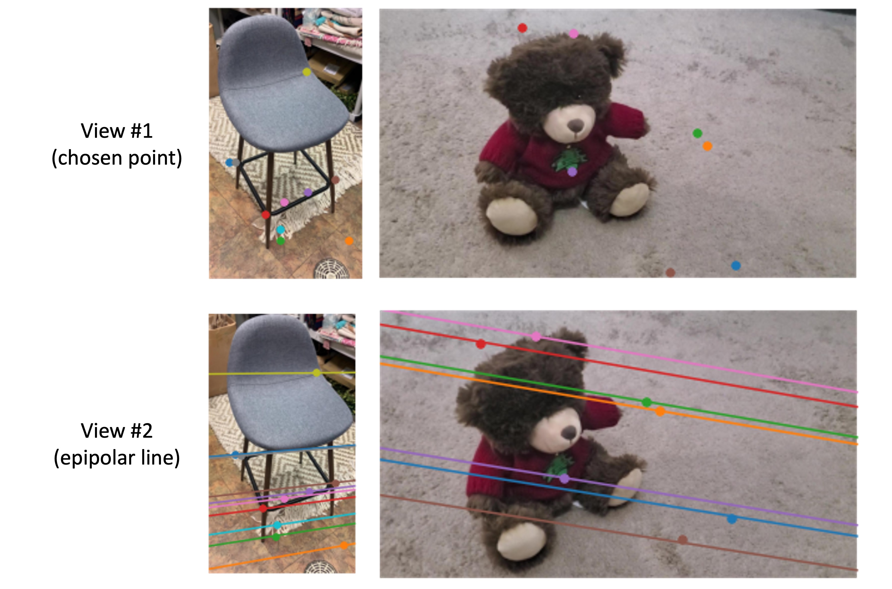
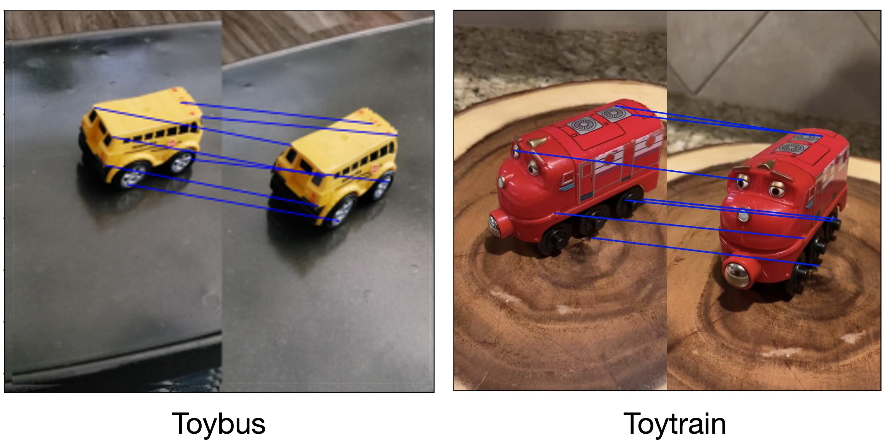
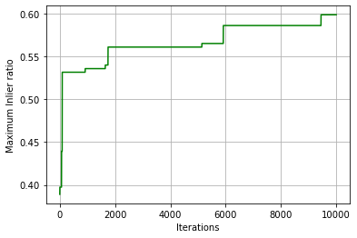
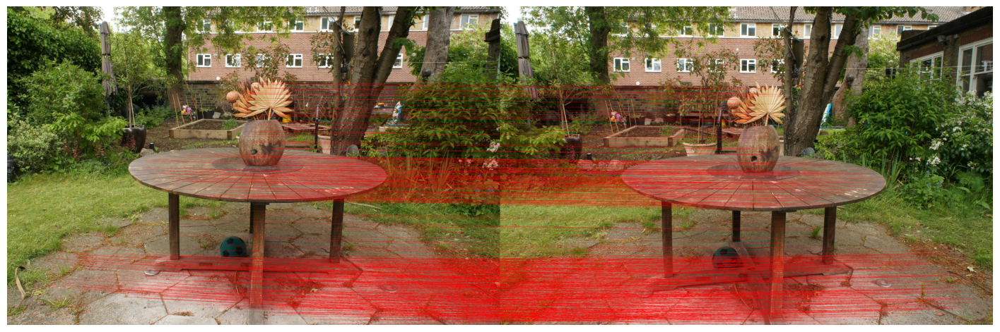
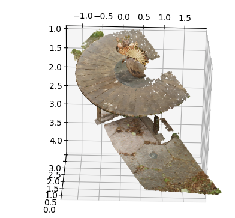
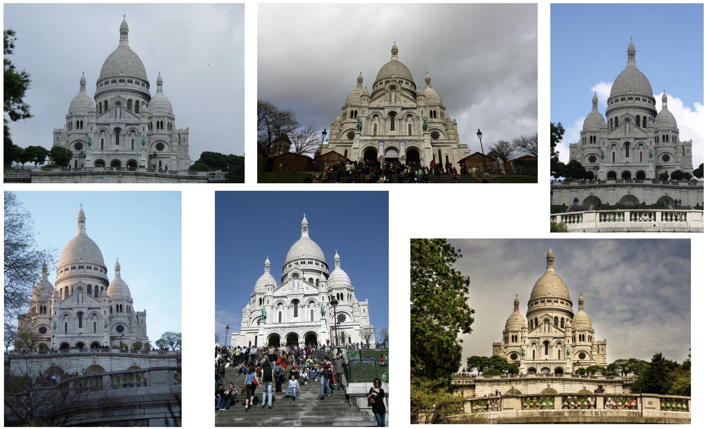
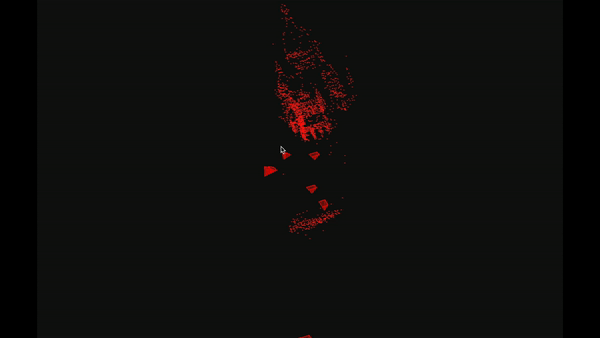

# HW3: 3D reconstruction

## Instructions
* Submitting your work: Check the instructions for submission and the late submission policy [here](https://geometric3d.github.io/submission.html).
* There are `6` questions in this assignment, where the last two are bonus questions. Make sure you follow the instructions and submit the answers as required.
* Make sure you review your submitted webpage and ensure the images and formulas are showing up correctly.

## Overview

In this assignment you will begin by implementing the methods to estimate the fundamental matrix from corresponding points in two images. Next, given the fundamental matrix and calibrated intrinsics (which will be provided) you will compute the essential matrix. Next, you will implement RANSAC to improve your algorithm and use this to compute a 3D metric reconstruction from 2D correspondences using triangulation. 


## Q1: 8-point and 7-point algorithm (40 points)

### (A1) F matrix using 8-point algorithm (15 points)

Given two images from the [Co3D dataset](https://ai.facebook.com/datasets/CO3D-dataset/), you need to implement the 8-point algorithm for estimating the fundamental matrix. 

**Data**

We provide 2 sets of two-view images along with the corresponding points in the two images as a `$object_corresp_raw.npz` file. Within each `.npz` file, the fields `pts1` and `pts2` are `N × 2` matrices corresponding to the `(x, y)` coordinates of the N points in the first and second image repectively. You can use >= 8 corresponding points (with better solutions given more constraints).

 * Run your code on the 2 sets of `2` images provided in the `data/q1a` folder for this question.

**Submission** 
 * Brief explanation of your implementation.
 * Epipolar lines: Show lines from fundamental matrix over the two images. See the following example figure:

| F-matrix visualizations |
| -----------  |
|  |


### (A2) E matrix using 8-point algorithm (5 points)

Given the estimated fundamental matrix `F` (from above) and intrinsic matrices `K1` and `K2` (that we provide as `intrinsic_matrices_$object.npz`), you need to compute the essential matrix `E`.

**Submission** 
 * Brief explanation of your implementation.
 * Provide your estimated `E`.


### (B) 7-point algorithm (20 points)

Since the fundamental matrix only has 7 degrees of freedom, it is possible to calculate `F` using only 7 point correspondences. This requires solving a polynomial equation. In this question, you will implement the 7-point algorithm.

**Data**

We provide `$object_7_point_corresp.npz` that consists of 7 precise correspondences (shown below) for you to run 7-point algorithm. 

| 7-point correspondence visualization  |
| -----------  |
|  |


 * Run your code on the 2 sets of `2` images provided in the `data/q1b` folder for this question.

**Hint**

There are probably multiple solutions from the 7-point algorithm. You need to choose the correct one manually or in whatever way you want. (E.g. Hint 1: what should the epipolar lines on these images look like? Hint 2: pick some extra correspondences to check whether the estimated `F` is correct.)


**Submission** 
 * Brief explanation of your implementation.
 * Epipolar lines: Similar to the above, you need to show lines from fundamental matrix over the two images.


## Q2: RANSAC with 7-point and 8-point algorithm (20 points)

In some real world applications, manually determining correspondences is infeasible and often there will be noisy coorespondences. Fortunately, the RANSAC method can be applied to the problem of fundamental matrix estimation.

**Data**

In this question, you will use the image sets released in `q1a` and `q1b` and calculate the `F` matrix using both 7-point and 8-point algorithm with RANSAC. The given correspondences `$object_corresp_raw.npz` consists potential inlier matches. Within each `.npz` file, the fields `pts1` and `pts2` are `N × 2` matrices corresponding to the `(x, y)` coordinates of the N points in the first and second image repectively. 

**Hint**
- There are around 50-60% of inliers in the provided data.
- Pick the number of iterations and tolerance of error carefully to get reasonable `F`.


**Submission** 
 * Brief explanation of your RANSAC implementation and criteria for considering inliers.
 * Report your best solution and plot the epipolar lines -- show lines from fundamental matrix that you calculate over the inliers.
 * Visualization (graph plot) of % of inliers vs. # of RANSAC iterations (see the example below). You should report such plots for both, the 7-pt and 8-pt Algorithms in the inner loop of RANSAC.

  


## Q3: Triangulation (20 points)

Given 2D correspondences and 2 camera matrices, your goal is to triangulate the 3D points. 

**Data**
- We provide the 2 images: `data/q3/img1.jpg` and `data/q3/img2.jpg`. 
- We provide the 2 camera matrices in `data/q3/P1.npy` and `data/q3/P2.npy`, both of which are `3x4` matrices.
- We provide 2D correspondences in `data/q3/pts1.npy` and `data/q3/pts2.npy`, where `pts1` and `pts2` are `Nx2` matrices. Below is a visualization of the correspondences:

 

**Submission**
- Brief explanation of your implementation.
- A colored point cloud as below:

 

## Q4: Reconstruct your own scene! (20 points)
For this part, you will run an off-the-shelf incremental SfM toolbox such as [COLMAP](https://github.com/colmap/pycolmap) on your own captured multi-view images. Please submit a gif of the reconstructed 3d structure and the location of cameras.

For this reconstruction, you can choose your own data. This data could either be a sequence having rigid objects, any object (for e.g. a mug or a vase in your vicinity), or any scene you wish to reconstruct in 3D.

**Submissions**
-  Multi-view input images.
-  A gif to visualize the reconstruction of the scene and location of cameras (extrinsics).
-  Run this on at least 2 sequences / objects / scenes

  | Example Multi-view images  | Output | 
  | ----------- | ----------- | 
  |    |  |  

## Q5: Bonus 1 - Fundamental matrix estimation on your own images. (10 points)

Capture / find at least 2 pairs of images, estimate the fundamental matrix.

**Hint**
- Use SIFT feature extractor (See the example code below), and compute potential matches.
```
import cv2
 
# Loading the image
img = cv2.imread('../data/q1/chair/image_1.jpg')
 
 # Converting image to grayscale
gray= cv2.cvtColor(img,cv2.COLOR_BGR2GRAY)
 
# Applying SIFT detector
sift = cv2.xfeatures2d.SIFT_create()

kp, des = sift.detectAndCompute(gray, None)

# Compute possible matches in any way you can think of.
```
- Use RANSAC with 7-point or 8-point algorithm to get `F`.
- Show the epipolar lines from the estimated `F`.

**Submission**
- Brief explanation of your implementation.
- Epipolar lines.

## Q6: Bonus 2 - Stress test the hyperparameters of COLMAP (10 points)
For this part, we want you to `stress test` or play with hyper-parameters in the COLMAP system. We want you to pick `2` interesting questions concerning this toolbox and for each of the question, we want you to provide a brief explanation with supporting qualitative or quantitative evidence. Some example question suggestions are:

-  What happens if we reduce number of input images?
-  Under what scenario and conditions does the reconstruction pipeline breaks?
-  What happens if we play with some tolerance parameters?

Above mentioned are just suggestions for you to play around the toolbox. Feel free to try anything you think could be interesting, and report back the findings.


**Submissions**
-  `2` questions and supporting explanations.


## What you can *not* do
* Download any code.
* Use any predefined routines except linear algebra functions.
  
## Tips
* It is a good idea to `assert` with sanity checks regularly during debugging.
* Normalize point and line coordinates.
* Remember that transformations are estimated up to scale, and that you are dealing with Projective Geometry.
* You *may not* use predefined routine to directly compute homography (e.g. `cv2.findHomography`). However, you *may* use predefined linear algebra/image interpolation libraries (e.g. `np.linalg`, `cv2.warpPerspective`). If you are unsure about what may or may not be used, don't hesitate to ask on Piazza.

* **Start Early and Have Fun!**
